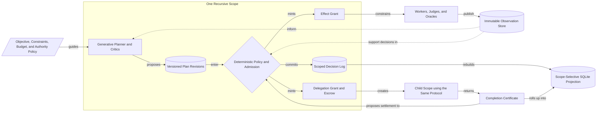
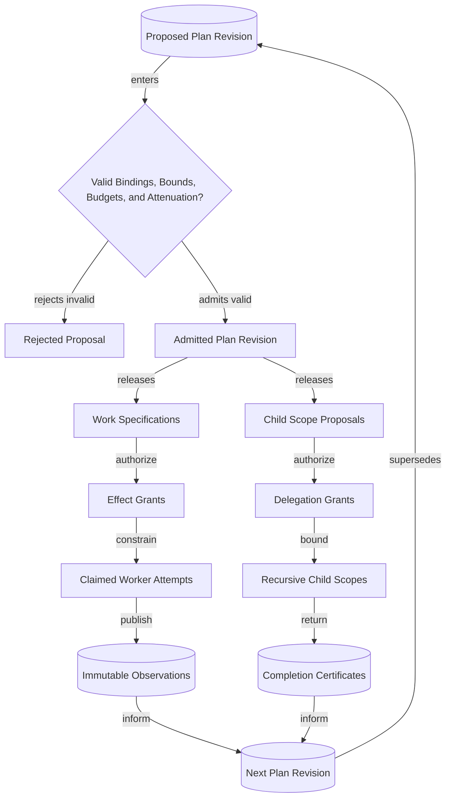
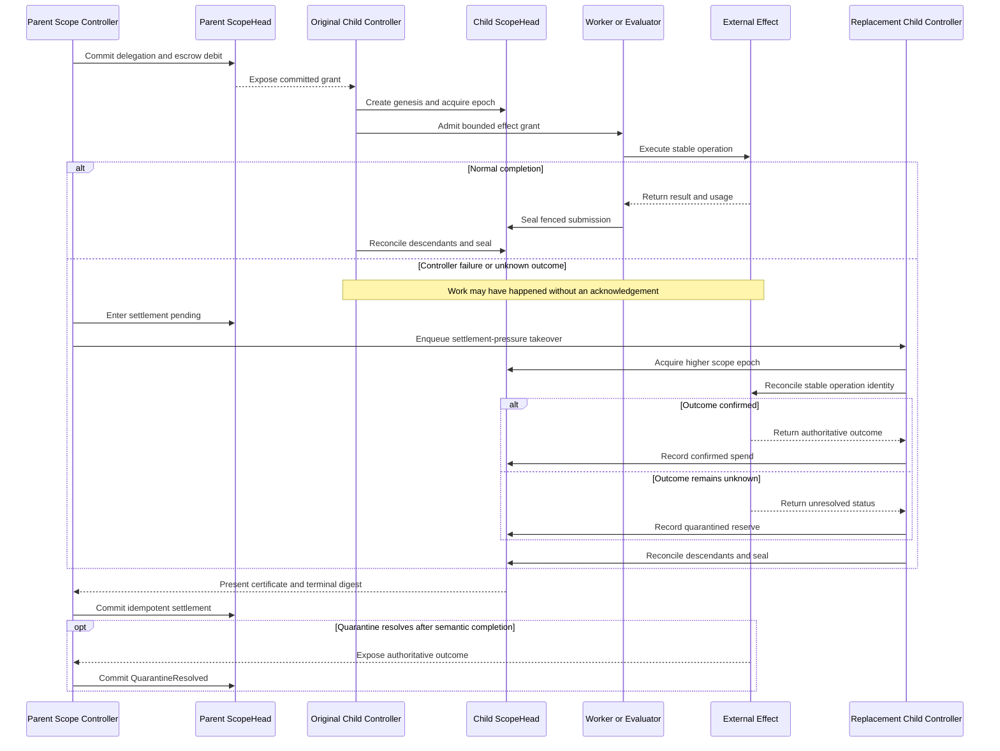

# MVP Evolution and Recursive Scope Design: 2026-08-09

## Status

Adopted scoped-v2 design authority. The active contracts are `mvp-outline.md`,
`epics.md`, Beads, and the frozen durable formats. The scoped-v2 choice from this design
has been incorporated into those contracts through the Phase 0 contract amendment;
remaining Phase 0 task-graph decomposition and disposition work is tracked by
`ravel-om4`.

Complete the remaining Phase 0 work, then implement Phase 1-and-later authority work
only on the scoped-v2 path. E01–E04 remain complete, frozen-v1 proofs. All new authority
work starts at a v2 root `Scope`, and no authoritative chain mixes v1 and v2 events.

The MVP proves the architecture with Distributed Research and Distributed Change. The
CPU-to-GPU rendering campaign in section 14 is post-MVP design guidance and carries no
contract or task-graph obligation.

## 1. Working direction

Ravel accepts objectives at its boundary and enforces contracts internally.

The user supplies an objective, constraints, budget, and authority policy. Planners
propose work. Deterministic admission grants authority. Workers publish immutable
observations. Scoped controllers admit revisions, accept results, delegate authority,
and decide completion.

The structural model has three independent shapes:

| Structure | Owns | Shape |
| --- | --- | --- |
| Authority tree | Scope controllers, delegation, escrow, attenuation, and settlement | Rooted tree |
| Versioned work graph | Claims, dependencies, claimable work, and child-scope proposals | Directed acyclic graph within admitted plan lineage |
| Immutable observation set | Artifacts, evidence, model output, evaluator results, and external outcomes | Append-only set |

A campaign is the root scope. Child scopes use the same protocol. A `WorkSpec` is the
smallest claimable unit. The authority tree, work DAG, and observation set remain
independent.

## 2. Canonical mental model



The root handles child certificates, settlements, and root policy. It does not
sequence every leaf transition. One daemon can control more than one scope, but each
has separate durable authority.

## 3. Canonical vocabulary

| Term | Meaning |
| --- | --- |
| `Campaign` | The root objective, configuration, and root scope identity |
| `Scope` | One recursively controlled authority and accounting boundary |
| `PlanRevision` | An immutable proposal containing the next bounded graph changes |
| `ClaimSpec` | A versioned semantic claim or outcome the scope is trying to establish |
| `WorkSpec` | A claimable, bounded execution leaf |
| `ChildScopeProposal` | A proposed bounded delegation to another recursive scope |
| `DelegationGrant` | Parent-authorized scope creation, authority limits, and escrow |
| `EffectGrant` | Scope-authorized permission for one bounded external execution |
| `Observation` | Immutable, exactly attributed output that is not authoritative by itself |
| `Decision` | A transition committed by the current scoped controller under policy |
| `CompletionCertificate` | A sealed summary of a child scope's terminal decisions and accounting |
| `Settlement` | Parent reconciliation of a child certificate and delegated escrow |

`ClaimSpec` describes a semantic goal. A work claim grants fenced ownership of one
`WorkSpec` revision.

## 4. Kernel invariants

These invariants apply at every scope depth.

1. **Observation immutability.** Decisions can supersede an observation's
   applicability. They cannot rewrite the observation.
2. **Exact attribution.** Each observation binds its scope, plan, work revision,
   attempt, subject, producer, evaluator or policy, and fences or digests.
3. **Scoped decision authority.** Only the current fenced controller commits decisions
   for its scope. A parent cannot bypass a live child's log.
4. **Exact binding.** Results apply only to the identities they evaluated. Replanning,
   rebasing, or policy changes create new identities.
5. **Budget conservation.** Escrow equals confirmed spend plus returned budget plus
   quarantined unknown reserve.
6. **Local authority enforcement.** Each external effect requires a scope-derived
   grant checked at execution. Planner output grants no authority.
7. **Fence separation.** A scope epoch fences decisions. A work-claim fence controls
   one `WorkSpec` revision. Neither replaces the other.
8. **Finite progress.** Policy bounds depth, fanout, attempts, follow-ups, deadlines,
   effects, and resource credits.
9. **Structural invalidation.** Contradicted claims suspend or revise their exact
   dependents. Unrelated work and observations remain valid.
10. **Capability attenuation.** Child grants can only narrow parent authority,
    resources, write scope, deadlines, and capabilities.
11. **Recursive settlement.** Children seal before parent settlement. Settlement is
    idempotent and cannot create evidence or budget.

```text
escrowed
  = confirmed_spend
  + returned
  + quarantined_unknown
```

Unknown reserve stays unavailable after the child seals.

## 5. Durable identity and versioning

Scoped v2 identity:

```text
campaign_id
scope_id
parent_scope_id
delegation_digest
plan_digest
work_id
work_revision
claim_fence
scope_epoch
```

The envelope version is independent of payload versions:

```text
EventEnvelope {
    envelope_version
    scope_id
    sequence
    parent_event
    writer_epoch
    operation_id
    payload_type
    payload_version
}
```

Each scope owns:

```text
ScopeHead
ordered decision stream
controller epoch
active plan lineage
```

The campaign root is a scope, not a global sequencer. Campaign metadata identifies the
root and its immutable configuration. Child decisions use child heads.

Keep existing v1 event, head, claim, and projection fixtures unchanged. A v2 campaign
starts with a v2 root scope. One authoritative chain never mixes v1 and v2 events.

## 6. Versioned planning and admission

Planning is generative. Admission is deterministic.

```text
PlanRevision {
    scope_id
    parent_plan_digest
    proposal_basis
    claim_specs
    work_specs
    child_scope_proposals
    dependencies
    bounds
}
```

A `PlanRevision` is immutable and content-addressed. Each revision supersedes its
predecessor. `proposal_basis` contains typed references to the objective, configuration,
observations, or child certificates that informed the proposal. A reference records
provenance. It does not establish the referenced claim. Old observations can inform a
new plan but satisfy work only when their bindings still match.



All authoritative work, delegation, budget spend, and external effects enter through
an admitted plan revision. No workflow API can bypass this boundary.

Admission validates:

- Exact scope, parent-plan, subject, policy, and configuration bindings.
- Proposal-basis existence, type, scope, and current bindings.
- Dependency existence and acyclicity within the admitted graph.
- Finite depth, fanout, attempt, deadline, effect, and resource bounds.
- Budget availability and atomic escrow for every child proposal.
- Grant attenuation and write/capability containment.
- Stable identities and no conflicting active revisions.
- Workflow-specific deterministic requirements.

Model agreement cannot override an admission failure.

## 7. Delegation and execution authority

A parent atomically commits a `DelegationGrant` and its escrow debit. Child genesis
references that grant. Both records must exist before the child gains authority.

`DelegationGrant` and `EffectGrant` share containment checks for budgets,
capabilities, write scopes, deadlines, and resources. Their lifecycles stay separate:

- A delegation grant creates one child authority domain and escrow account.
- An effect grant authorizes one bounded worker, model, evaluator, Git, or code-host
  operation.

The MVP caps scope depth at two. Admitted policy also bounds fanout, attempts,
deadlines, and resources.

## 8. Scope authority and lifecycle

Each scope has a head, ordered log, controller epoch, and active plan lineage. One
daemon can own more than one scope controller. The durable scope head holds authority.

A node advances a scope epoch only for decision, settlement, cancellation, or routing
work. Presence guides placement but grants no authority.

Child scope lifecycle:

```text
PENDING -> ACTIVE -> DRAINING -> SEALED
                    \-> RECOVERING -> SEALED
```

Parent delegation lifecycle:

```text
COMMITTED -> ACTIVE -> SETTLEMENT_PENDING -> SETTLED
                     \-> EXPIRED_PENDING -> SETTLED
```

Cancellation is a drain, not an undo:

- Cancellation blocks new work and effect admission.
- Existing effect grants retain their original deadlines.
- The supervisor stops local waits and reconciles remote outcomes.
- Drain timeouts cannot extend authority.
- Sealing proceeds bottom-up.

## 9. Certificates, settlement, and quarantine

A completion certificate contains:

```text
scope_id
delegation_digest
plan_digest
terminal_head_digest
decision_policy_digest
supported_claims
unresolved_claims
evidence_root
confirmed_spend
returned_budget
unknown_reserve
```

A certificate summarizes a sealed scope. It cannot upgrade evidence, erase history, or
force claim acceptance. Parent policy evaluates its claims. Required unresolved claims
block their exact parent dependents.

Settlement is idempotent:

- Confirmed spend remains charged.
- Parent settlement releases returned budget.
- Unknown reserve stays unavailable and moves to the parent's accounting lane.
- Only a root `QuarantineResolved` decision can reclassify root unknown reserve after
  an authoritative external outcome.

A root can complete while accounting remains open. Its completion record reports
unknown reserve. After completion, the root accepts only reconciliation and accounting
events.

## 10. Settlement-pressure recovery

An expired, unsettled child triggers takeover even without worker traffic.



Takeover demand comes from:

- Pending decisions or observations.
- Ordinary work-routing demand.
- Cancellation or drain progress.
- A parent blocked on an expired, unsettled child.

## 11. Distributed execution

Work ownership is scope-relative. Every claim and submission binds:

```text
campaign_id
scope_id
plan_digest
work_id
work_revision
claim_fence
```

Keep the same-key compare-and-swap rule for claim acquisition, renewal, reclamation,
and sealing. Add scope and admitted-plan bindings. A work claim authorizes one
`WorkSpec`. It does not authorize scope decisions or external effects.

Workers, judges, and oracles publish immutable observations. The scoped controller
validates bindings and applies policy before an observation changes state.

External effects use stable operation identities, at-least-once execution, explicit
unknown outcomes, and read-before-retry reconciliation. Sandboxes, evaluators, and
code-host publishers remain separate trust domains.

## 12. Storage and projection

S3 holds shared durable authority. SQLite is a disposable local projection.

Scoped v2 key axis:

```text
workspace/{workspace_id}/campaigns/{campaign_id}/
  scopes/{scope_id}/head
  scopes/{scope_id}/events/...
  scopes/{scope_id}/claims/{work_id}/{work_revision}
  plans/{plan_digest}
  artifacts/{digest}
```

The v2 contract fixes exact suffixes and encodings. Independent scopes do not share a
mutable head or replay cursor.

Local projection uses:

- Scope-indexed tables and cursors.
- Scope-selective replay.
- Bounded-subtree scheduling queries.
- Lazy global views.
- Certificate-based ancestor rollups.
- On-demand loading of archived scope histories.

Sealed logs can leave the hot projection but remain durable authority. Certificates
reduce ancestor work but never replace child history.

## 13. Objective to distributed work

An objective starts planning. It does not authorize execution. A campaign can start
with a fixed plan, derive work from observations, or combine both.

### Environment-derived work discovery

The [State2State paper](https://arxiv.org/abs/2608.04934) derives tasks from reachable
state pairs and verifies success against environment state. Ravel uses the broader
pattern. Environment-derived work discovery is a planning source, not a campaign type
or a separate authority path.

```text
campaign evidence
  -> candidate target
  -> bounded proposal
  -> deterministic admission
  -> execution
  -> trusted verification
  -> new evidence or stop
```

A generator can be a model, a person, a deterministic analyzer, a search heuristic, or
an exploration policy. Each candidate must name:

- The parent objective or unresolved `ClaimSpec`.
- The observations and certificates that form its basis.
- A target predicate and the verifier that can test it.
- Proposed `WorkSpec` or child-scope changes and their dependencies.
- Required effects, resource bounds, failure states, and a stop condition.

Campaign policy defines what can be observed, which discovery actions are legal,
whether reset or replay is supported, which targets matter, and what each verifier
establishes. The runtime records the basis, admits or rejects a `PlanRevision`, issues
bounded grants, and retains the resulting observations.

Exact state equality is one verifier, not the abstraction. A campaign can use tests,
builds, invariants, metrics, simulations, structured state, or explicit review. A
completion claim cannot exceed what its verifier checks.

The environment does not remove specification work. Someone must define observable
state, legal actions, target value, verifier limits, and completion policy. More agents
can search more candidates. They do not guarantee an optimal plan. Evidence, policy,
and budget determine what advances.

## 14. MVP and post-MVP scope

### MVP amendment

If the MVP must prove recursion, Distributed Research uses:

1. Root bootstrap.
2. An admitted planning revision.
3. Independent research work.
4. Critic work.
5. At most one discriminating follow-up child scope.
6. Synthesis, child certificates, settlement, and a root certificate.

Distributed Change uses child scopes only for bounded ownership, such as packages or
non-overlapping target groups. The kernel excludes port taxonomies, workflow profiles,
and dependency planners.

Implement Research and Change before extracting a workflow trait or domain-specific
language (DSL).

The MVP preserves the environment-derived planning seam without building a curriculum
engine. It records proposal bases and permits bounded follow-up `PlanRevision`s after
new observations. Discovery rules and target predicates stay in campaign policy. Do
not extract a generic discovery interface until materially different campaign types
show the same contract.

The MVP excludes online model training, learned reward policies, a universal state
matcher, and unbounded task generation.

### CPU-to-GPU image rendering campaign (post-MVP)

A post-MVP campaign candidate evaluates GPU offload for an existing CPU-only C++ image
rendering service. It composes Research, Change, and trusted evaluation. The kernel gains
no GPU-specific types.

This campaign is design guidance only. The MVP proves the architecture with Distributed
Research and Distributed Change; the active contracts and task graph carry no
GPU execution obligation. Adopt this campaign through a later contract amendment if the
recursive substrate is proven and the workload still matters.

The campaign asks:

> Which operations improve end-to-end service performance on the target workload after
> transfer, launch, synchronization, memory, and fallback costs?

The root scope fixes:

- Source revision, build, CPU, GPU, driver, and library versions.
- Workload corpus, image sizes, formats, operation mixes, concurrency, and warm or
  cold state.
- CPU reference output and exact or tolerance-based correctness rules.
- Primary end-to-end metrics, diagnostic metrics, and acceptance thresholds.
- Experiment budget, implementation budget, and stopping rule.

Research profiles the CPU baseline before proposing GPU work. It ranks operations by
CPU cost, parallelism, arithmetic intensity, data movement, batching, and library
support. A CPU hotspot alone does not justify offload.

| Operation class | Offload case | Reject when |
| --- | --- | --- |
| Convolution, blur, sharpen, and neighborhood filters | Large regular grids expose parallel work and data reuse | Images are small or setup and edge handling dominate |
| Resize, warp, rotation, and color conversion | Pixels can run independently and remain on the device | A single small stage requires two host-device transfers |
| Compositing, blending, and tone mapping | Layers share regular per-pixel math | Branching, sparse regions, or small layers limit parallel work |
| Decode or encode | A supported accelerator preserves required format and quality | Codec support, output parity, or transfer cost fails the contract |
| Fused rendering stages | Several operations reuse device-resident data | CPU work forces synchronization between stages |

Keep metadata handling, request routing, irregular control flow, and small one-off jobs
on the CPU unless measurement proves an end-to-end gain.

Experiment sequence:

1. Freeze the workload, correctness contract, hardware, software, and metrics.
2. Profile the CPU service and select bounded candidate operations.
3. Build the smallest GPU prototype for each candidate. Keep the CPU path as reference.
4. Run an A/A control: pass the same CPU artifact through both benchmark labels.
5. Run CPU and GPU treatments in randomized complete blocks across the target hosts
   and time windows. Record the seed and reset state between treatments. Each complete
   block supplies one analysis contrast; requests within a run are subsamples.
6. Measure total render latency from accepted request to completed output and sustained
   throughput. Record kernel time, transfer time, synchronization, CPU use, GPU use,
   memory, failures, and cost as diagnostics.
7. Retain crashes, timeouts, out-of-memory results, and invalid outputs.
8. Classify each candidate as `IMPLEMENT`, `REJECT`, or `INCONCLUSIVE`.
9. Integrate `IMPLEMENT` candidates with a CPU fallback, then rerun correctness,
   performance, and failure tests on the full service.

The root owns the workload and decision gates. A candidate starts as a `WorkSpec`.
Use a child scope only when the candidate needs a bounded prototype, correctness proof,
benchmark, and implementation sequence.

A fast GPU kernel does not pass the campaign if transfers erase the gain. A campaign
that rejects every candidate is complete when the evidence and accounting close.

### Post-MVP expansion

After measuring the substrate and MVP campaigns:

- Objective-to-contract research before implementation begins.
- Compiling accepted behavioral contracts into versioned work and child scopes.
- Deeper scope trees when depth two fails measured workloads.
- Additional concrete Verify, Document, and Search protocols.
- Scope placement and selective replay tuned from measurements.
- Generator and candidate-filter comparisons across different campaign types.
- Offline task datasets from replayable transitions after provenance, privacy, and
  verifier-quality gates.
- Empirical generator, judge, and oracle routing.

## 15. Structural decisions and tunable choices

Structural decisions:

- Authority, work, and observations use separate structures.
- Campaigns and child scopes use one recursive protocol.
- Each scope has fenced authority and an ordered decision log.
- Plan revisions admit work and delegation.
- Grants authorize delegation and external effects.
- Work fences and scope epochs remain separate.
- Escrow, settlement, and quarantine conserve budget.
- Children settle bottom-up.
- S3 holds durable authority. SQLite provides scope-selective projections.
- Initial and observation-derived work use the same plan-admission path.
- Model output is an observation, not authority.

Tunable choices:

- Depth and fanout caps.
- Which workflow boundaries merit a child scope rather than a `WorkSpec`.
- Scope placement, takeover preference, and scheduling heuristics.
- SQLite layout and hot-history retention.
- Certificate indexing and projection compaction.
- Generator mix and candidate filters.
- Planner, critic, judge, and model prompts.
- Lease, batch, concurrency, and replay-window values.

## 16. Amendment sequence

This sequence becomes active only after the plan amendment.

| Phase | Work | Required proof |
| --- | --- | --- |
| 0. Contract amendment | Revise the outline, epics, task graph, identity axis, keys, and v2 envelope together | Recursive protocol is coherent before new scoped payloads |
| 1. Scoped substrate | Add `ScopeId`, scoped heads, events, claims, work references, and selective projection | Two scopes advance and rebuild independently |
| 2. Scoped authority | Implement per-scope leases, lazy takeover, and settlement-pressure scheduling | Parent and child controllers fail independently |
| 3. Recursive admission | Implement plan revisions with typed proposal bases, shared admission, grants, escrow, sealing, certificates, and settlement | A bounded observation-derived revision completes and conserves budget |
| 4. Workflow proof | Build Research and Change on the recursive substrate | No flat workflow path requires later replacement |
| 5. Scale proof | Exercise many scopes and nodes, selective replay, failover, and unknown outcomes | Root and projections avoid global hot paths |

Phase 1 reuses compare-and-swap, immutable publication, exact-chain replay, disposable
projection, and work-claim fencing. It adds scope parameters and a v1-to-v2 boundary.

## 17. Deferred work

- Workflow DSLs and campaign profiles.
- Arbitrary live reparenting.
- Multiple authority parents.
- Conflict-free replicated data types and gossip for correctness.
- Automatic repartitioning.
- Learned placement.
- Cryptographic bearer capabilities under the trusted-fleet threat model.

## 18. Revision discipline

1. Record the failed assumption or measured limit.
2. Classify it as structural or tunable.
3. Prefer the smallest amendment that preserves existing proofs.
4. Version durable identity and bytes. Never reinterpret old records.
5. After adoption, update the architecture, epics, task graph, and fixtures together.
6. Record unresolved questions until evidence resolves them.
